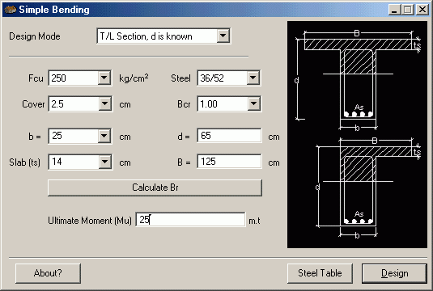



## RC Beams Design

### Description

Design of Reinforced Concrete Beams using the principles of the ULTIMATE STRENGTH STATE DESIGN Method according to the ECP1995 (Egyptian Code od Practice).
 
### More Info
 

             |
---                |---
**Submitted On**   |2003-07-11 18:09:24
**By**             |[Waleed Nassef](https://github.com/Planet-Source-Code/PSCIndex/blob/master/ByAuthor/waleed-nassef.md)
**Level**          |Intermediate
**User Rating**    |4.2 (21 globes from 5 users)
**Compatibility**  |VB 5\.0, VB 6\.0
**Category**       |[Miscellaneous](https://github.com/Planet-Source-Code/PSCIndex/blob/master/ByCategory/miscellaneous__1-1.md)
**World**          |[Visual Basic](https://github.com/Planet-Source-Code/PSCIndex/blob/master/ByWorld/visual-basic.md)
**Archive File**   |[RC\_Beams\_D1620887282003\.zip](https://github.com/Planet-Source-Code/waleed-nassef-rc-beams-design__1-47210/archive/master.zip)

